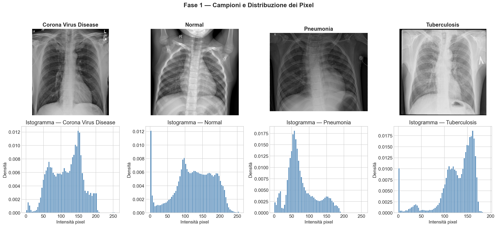
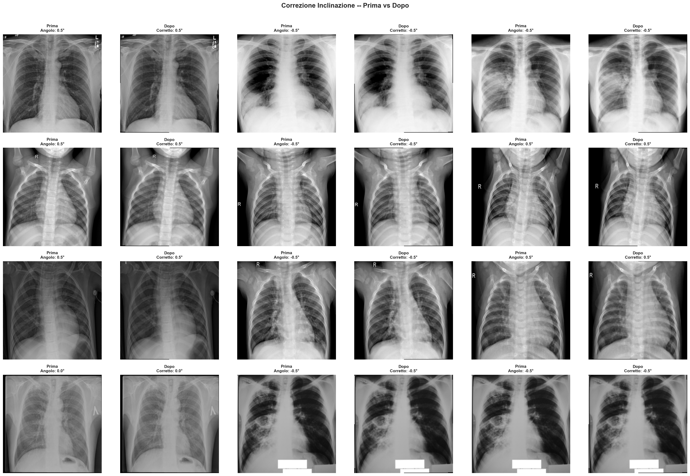
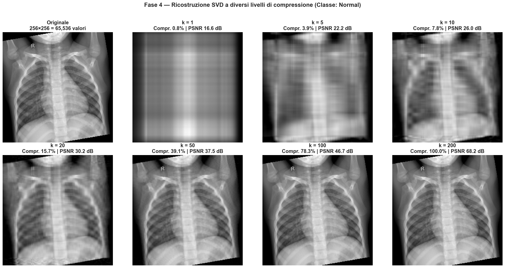
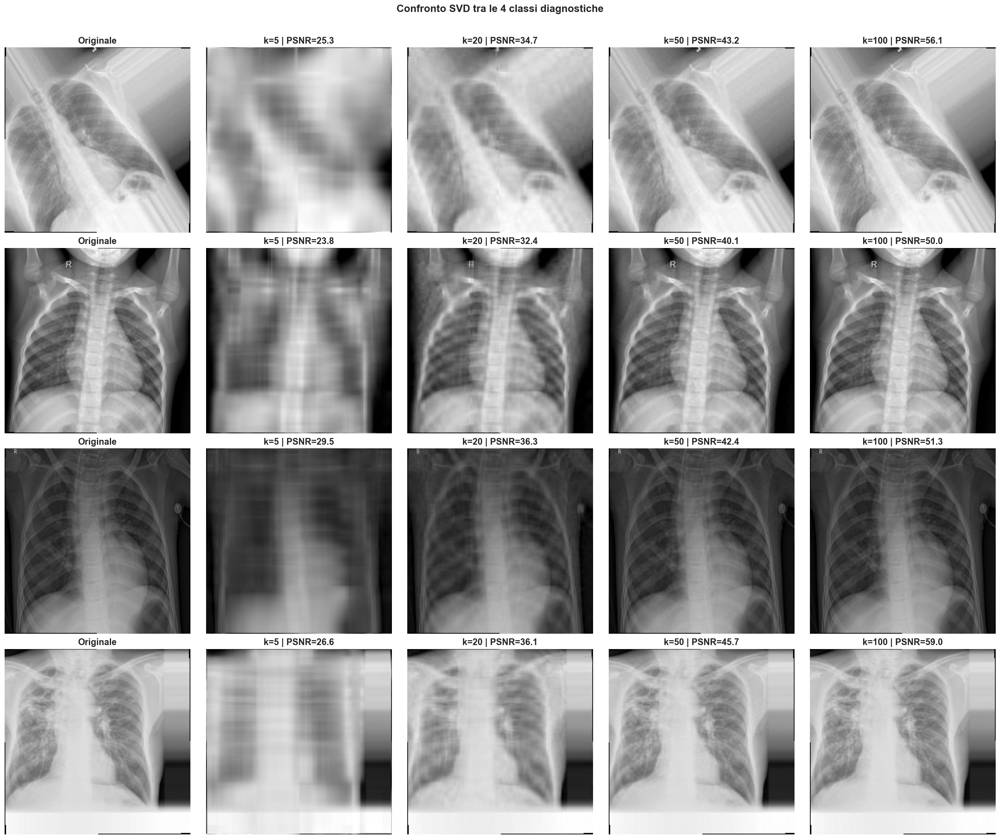
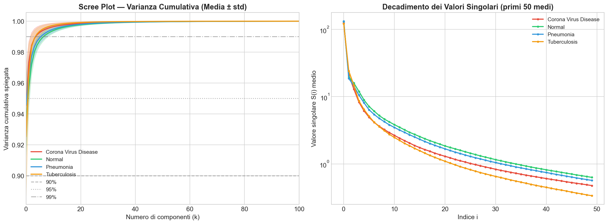
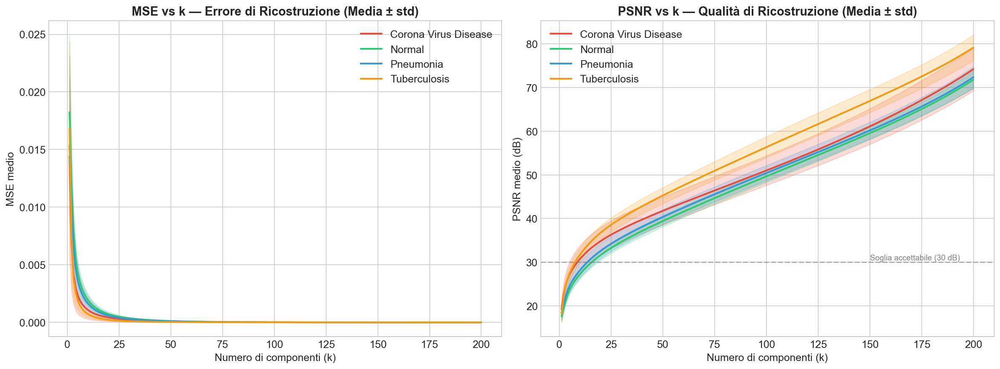
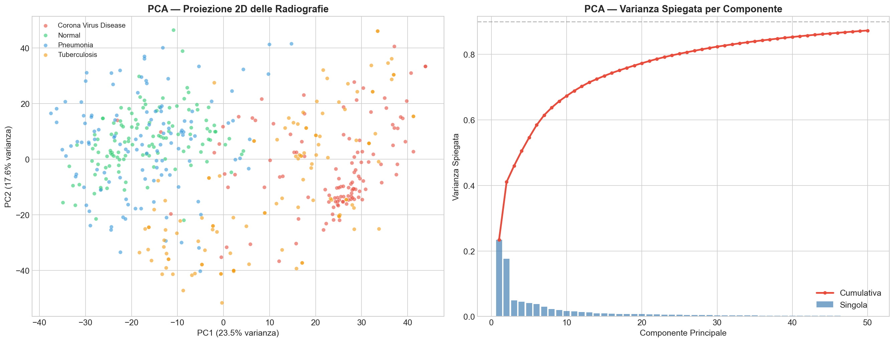
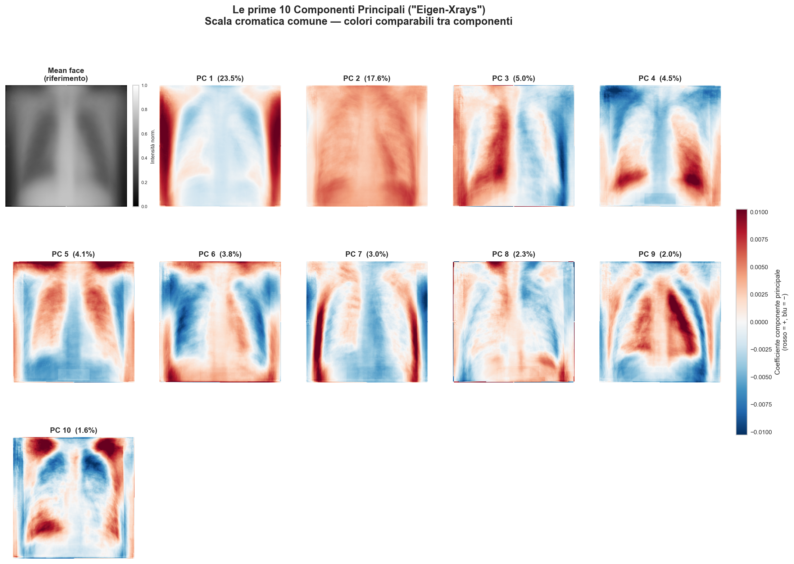
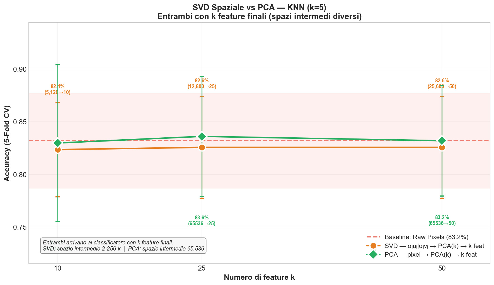
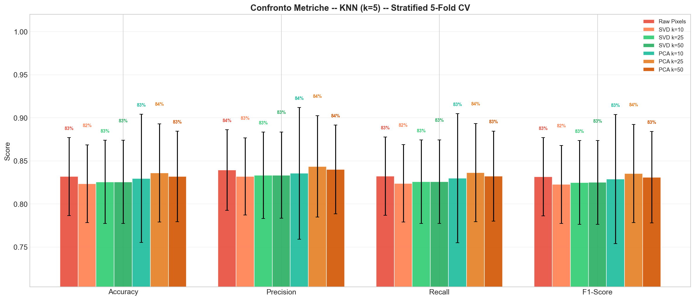

# SVD or PCA for Image Analysis in Medical Diagnostics

**Corso:** Statistical Methods — Politecnico di Bari, 1° Anno  
**Dataset:** Lung X-Rays Grayscale — 4 classi diagnostiche  
**Tecnologie:** Python · NumPy · scikit-learn · Pillow · Matplotlib/Seaborn

---

## Indice

1. [Motivazione Clinica](#1-motivazione-clinica)
2. [Dataset e Classi Diagnostiche](#2-dataset-e-classi-diagnostiche)
3. [Fondamenti Matematici](#3-fondamenti-matematici)
   - 3.1 [Singular Value Decomposition (SVD)](#31-singular-value-decomposition-svd)
   - 3.2 [Principal Component Analysis (PCA)](#32-principal-component-analysis-pca)
   - 3.3 [Relazione SVD ↔ PCA](#33-relazione-svd--pca)
4. [Pipeline di Analisi](#4-pipeline-di-analisi)
   - 4.1 [Fase 1 — Esplorazione dei Dati](#41-fase-1--esplorazione-dei-dati)
   - 4.2 [Fase 2 — Pre-elaborazione](#42-fase-2--pre-elaborazione)
   - 4.3 [Fase 3 — SVD: Decomposizione, Ricostruzione e Analisi](#43-fase-3--svd-decomposizione-ricostruzione-e-analisi)
   - 4.4 [Fase 4 — PCA: Riduzione Dimensionale sul Dataset](#44-fase-4--pca-riduzione-dimensionale-sul-dataset)
   - 4.5 [Fase 6 — Classificazione: SVD Compressione vs PCA Riduzione Dimensionale](#45-fase-6--classificazione-svd-compressione-vs-pca-riduzione-dimensionale)
5. [Architettura del Codice](#5-architettura-del-codice)
6. [Discussione Critica](#6-discussione-critica)
7. [Conclusioni](#7-conclusioni)

---

## 1. Motivazione Clinica

Le radiografie toraciche sono uno degli strumenti diagnostici più diffusi in medicina: ogni ospedale produce migliaia di immagini al giorno. Questo genera due problemi pratici:

- **Spazio di archiviazione:** una radiografia ad alta risoluzione può occupare decine di MB. Moltiplicando per i volumi ospedalieri, la necessità di compressione è concreta.
- **Trasmissione in telemedicina:** la diagnostica remota richiede l'invio di immagini su reti a banda limitata; la compressione senza perdita diagnostica è fondamentale.

Il progetto si chiede: **è possibile comprimere significativamente una radiografia polmonare mantenendo intatta l'informazione diagnosticamente rilevante?** E, in parallelo: **le tecniche di riduzione dimensionale riescono a distinguere automaticamente diverse patologie polmonari?**

SVD e PCA sono gli strumenti matematici scelti per rispondere a queste domande.

---

## 2. Dataset e Classi Diagnostiche

### Composizione

Il dataset contiene radiografie toraciche in scala di grigi suddivise in **4 classi**:

| Classe | Patologia | N° immagini disponibili | N° immagini usate |
|---|---|---|---|
| **Corona Virus Disease** | COVID-19 | 122 | ≤ 120 |
| **Normal** | Polmoni sani | 540 | ≤ 120 |
| **Pneumonia** | Polmonite batterica/virale | 186 | ≤ 120 |
| **Tuberculosis** | Tubercolosi polmonare | 333 | ≤ 120 |

### Caratteristiche delle immagini grezze

Le immagini originali hanno dimensioni eterogenee:

| Classe | Dimensione campione | Range intensità | Media | Dev. Std. |
|---|---|---|---|---|
| COVID-19 | 230 × 203 px | 0–255 | 116.07 | 44.54 |
| Normal | 1654 × 1678 px | 0–255 | 124.91 | 57.82 |
| Pneumonia | 1216 × 1512 px | 0–255 | 77.16 | 41.98 |
| Tuberculosis | 512 × 512 px | 0–193 | 126.62 | 39.60 |


### Osservazioni diagnostiche dagli istogrammi (Fase 1)

- **COVID-19:** distribuzione concentrata nelle tonalità medio-alte (100–170), coerente con le opacità a vetro smerigliato tipiche del COVID.
- **Normal:** distribuzione più uniforme su tutto il range, buon contrasto tra tessuti.
- **Pneumonia:** forte picco nelle tonalità scure (30–80), coerente con addensamenti polmonari densi.
- **Tuberculosis:** distribuzione bimodale con picco nelle tonalità chiare (150–190), indicativo di lesioni fibrotiche calcificate.

---

## 3. Fondamenti Matematici

### 3.1 Singular Value Decomposition (SVD)

Data una matrice immagine $A \in \mathbb{R}^{m \times n}$ (con $m = n = 256$), la SVD la fattorizza come:

$$A = U \cdot \Sigma \cdot V^T$$

dove:
- $U \in \mathbb{R}^{m \times r}$: **vettori singolari sinistri** — catturano le strutture spaziali lungo le righe
- $\Sigma \in \mathbb{R}^{r \times r}$: matrice diagonale con **valori singolari** $\sigma_1 \geq \sigma_2 \geq \ldots \geq \sigma_r \geq 0$, con $r = \min(m, n)$
- $V^T \in \mathbb{R}^{r \times n}$: **vettori singolari destri** — catturano le strutture lungo le colonne

I valori singolari quantificano l'"importanza" di ciascuna direzione: $\sigma_1$ codifica la variazione di maggiore energia (es. contrasto globale), i valori successivi pattern via via più fini.

#### Implementazione (svd_engine.py)

```python
U, S, Vt = np.linalg.svd(image_matrix, full_matrices=False)  # economy SVD
```

#### Approssimazione di rango k

Mantenendo solo le prime $k$ componenti si ottiene la **ricostruzione troncata**:

$$A_k = \sum_{i=1}^{k} \sigma_i \cdot \mathbf{u}_i \cdot \mathbf{v}_i^T = U_k \cdot \Sigma_k \cdot V_k^T$$

```python
reconstructed = (U[:, :k] * S[:k]) @ Vt[:k, :]
```

#### Teorema di Eckart-Young (1936) — Il nucleo teorico del progetto

> **$A_k$ è la migliore approssimazione di rango $k$ di $A$ in norma di Frobenius:**
> $$A_k = \arg\min_{\operatorname{rank}(B) = k} \|A - B\|_F$$
> con errore minimo:
> $$\|A - A_k\|_F = \sqrt{\sum_{i=k+1}^{r} \sigma_i^2}$$

Questo è il fondamento teorico che rende la SVD **ottimale** per la compressione: non esiste nessun'altra decomposizione di rango $k$ che approssimi meglio l'immagine originale.

#### Rapporto di compressione

Con $k$ componenti si memorizzano $k(m + n + 1)$ valori anziché $m \cdot n$:

$$\text{compression ratio} = \frac{k(m + n + 1)}{m \cdot n}$$

Per $m = n = 256$: con $k = 20$, compression ratio ≈ **15.7%**.

#### Metriche di qualità

| Metrica | Formula | Soglia pratica in radiologia |
|---|---|---|
| **MSE** | $\frac{1}{mn}\sum_{i,j}(A_{ij} - \hat{A}_{ij})^2$ | Più basso = meglio |
| **PSNR** | $10 \log_{10}\!\left(\frac{1}{\text{MSE}}\right)$ [dB] | **> 30 dB** considerato accettabile diagnosticamente |

---

### 3.2 Principal Component Analysis (PCA)

La PCA cerca le direzioni di **massima varianza** nello spazio delle immagini. Applicata a un dataset di $N$ immagini di $d = 256 \times 256 = 65\,536$ pixel:

1. Si costruisce la matrice dati $X \in \mathbb{R}^{N \times d}$ (ogni riga = un'immagine appiattita)
2. Si centra: $\tilde{X} = X - \bar{X}$
3. La PCA trova le componenti principali $\mathbf{v}_1, \mathbf{v}_2, \ldots$ che massimizzano $\operatorname{Var}(\tilde{X} \mathbf{v}_i)$ con vincolo di ortogonalità

#### Implementazione (src/pca_engine.py)

```python
X = all_images.reshape(all_images.shape[0], -1)  # (N, 65536)
pca_model = PCA(n_components=50)
X_pca = pca_model.fit_transform(X)               # (N, 50)
```

La libreria `sklearn.decomposition.PCA` utilizza internamente la SVD randomizzata per efficienza.

#### Eigenfaces / Eigen-Xrays

Le **componenti principali** possono essere visualizzate come immagini 256 × 256. Mostrano i pattern visivi dominanti nel dataset:

| Componente | Varianza spiegata | Pattern clinico associato |
|---|---|---|
| **PC1** | 25.6% | Contrasto globale luminosità/sfondo |
| **PC2** | 17.4% | Simmetria laterale del torace |
| **PC3** | 5.1% | Pattern mediastinico |
| **PC4** | 4.8% | Strutture costali |
| **PC5–10** | 1.6–3.9% | Dettagli fini: campi polmonari, diaframma, apici |

---

### 3.3 Relazione SVD ↔ PCA

> **PCA e SVD non sono due metodi diversi: la PCA è la SVD applicata alla matrice dei dati centrata.**

| Passo | Operazione |
|---|---|
| 1. Flatten | Ogni immagine $(256 \times 256)$ → vettore $\mathbf{x} \in \mathbb{R}^{65536}$ |
| 2. Stack | Matrice dati $X \in \mathbb{R}^{N \times 65536}$ |
| 3. Centra | $\tilde{X} = X - \bar{X}$ |
| 4. SVD | $\tilde{X} = U \Sigma V^T$ |
| 5. Componenti principali | Colonne di $V^T$ (= direzioni di massima varianza) |
| 6. Proiezione | $X_\text{PCA} = \tilde{X} \cdot V_k^T \in \mathbb{R}^{N \times k}$ |

Mentre la SVD per la compressione opera su **una singola immagine**, la PCA opera sull'**intero dataset**. Le due tecniche sono complementari, non alternative:

| | SVD per compressione | PCA per analisi |
|---|---|---|
| **Input** | Singola immagine $A \in \mathbb{R}^{m \times n}$ | Dataset $X \in \mathbb{R}^{N \times d}$ |
| **Output** | Approssimazione $A_k$ | Proiezione $X_\text{PCA} \in \mathbb{R}^{N \times k}$ |
| **Obiettivo** | Ridurre i dati da memorizzare | Trovare struttura latente comune |
| **Uso pratico** | Compressione, trasmissione | Classificazione esplorativa, visualizzazione |

---

## 4. Pipeline di Analisi

### 4.1 Fase 1 — Esplorazione dei Dati

**Obiettivo:** verificare la validità strutturale delle immagini e capire le loro caratteristiche statistiche prima di qualsiasi elaborazione.

**Operazioni:**
- Conteggio immagini per classe (`count_images()`)
- Ispezione di shape, dtype, range e distribuzione dei pixel (`print_sample_properties()`)
- Verifica che ogni immagine sia 2D (scala di grigi)
- Esclusione preventiva delle **radiografie laterali** (proiezione di profilo, non PA)

**Rilevamento radiografie laterali (`is_lateral_xray`):**  
Si calcola il profilo medio di intensità per colonna e si conta la frazione di colonne con segnale significativo (> 30% del max). Se < 60% delle colonne è attiva → immagine laterale, scartata.



---

### 4.2 Fase 2 — Pre-elaborazione

**Obiettivo:** portare tutte le immagini in un formato uniforme adatto all'analisi matriciale.

```
File .jpg/.png (immagine grezza, dimensioni originali)
  │
  ├─ 1. Caricamento e conversione in scala di grigi (PIL, modalità 'L')
  │
  ├─ 2. Filtraggio radiografie laterali  ──► SCARTA se profilo attivo < 60%
  │      (su immagine grezza, dimensioni originali)
  │
  ├─ 3. Validazione immagine  ──────────────► SCARTA se non valida
  │      · file noti corrotti (blacklist 12 file)
  │      · padding artificiale (≥ 3 angoli con media > 130)
  │      · tilt eccessivo (|θ| > 10°)
  │      (su immagine grezza, dimensioni originali)
  │
  ├─ 4. Resize 256×256 (interpolazione LANCZOS)
  │
  ├─ 5. Normalizzazione → float64 in [0, 1]
  │
  └─ 6. Correzione inclinazione (se |θ| ≥ 0.5°)
         · scipy_rotate(image, -θ, order=1, mode='constant', cval=0.0)
         · clip finale in [0, 1]
```

> **Nota:** la validazione (step 2–3) avviene sull'immagine originale a piena risoluzione. Solo le immagini che superano i controlli vengono ridimensionate. La correzione tilt (step 6) opera sull'immagine già ridimensionata a 256×256.

#### Scarto vs correzione del tilt

Le due operazioni riguardano **immagini diverse**:

| Operazione | Soglia | Cosa succede |
|---|---|---|
| **Scarto** (`is_valid_image`) | `\|θ\| > 10°` | Inclinazione grave → irrecuperabile, rimossa dal dataset |
| **Correzione** (`correct_tilt`) | `0.5° ≤ \|θ\| ≤ 10°` | Inclinazione lieve → raddrizzata automaticamente |
| **Nessuna azione** | `\|θ\| < 0.5°` | Già correttamente orientata |

#### Correzione dell'inclinazione (Tilt Detection)

**Principio:** nelle rx toraciche le costole creano strutture fortemente orizzontali. Un'immagine correttamente orientata produce un profilo riga con alta varianza del gradiente. L'algoritmo cerca l'angolo che massimizza questa varianza:

$$\theta^* = \arg\max_\theta \operatorname{Var}\!\left(\nabla_\text{row}\left[\text{rotate}(A, -\theta)\right]\right)$$

**Ricerca a due passi per efficienza:**
1. **Coarse** — step 2°, range ±25°, immagine downscaled a 128px per velocità
2. **Fine** — step 0.5°, intorno al massimo coarse ±3°

#### Filtraggio immagini non valide

| Criterio | Soglia | Azione |
|---|---|---|
| Rx laterale | profilo attivo < 60% | Scartata |
| Tilt eccessivo | `|θ| > 10°` | Scartata |
| Padding corrotto | ≥ 3 angoli con media > 130/255 | Scartata |
| File noti corrotti | lista hardcoded (12 file) | Scartati |



**Parametri globali (config.py):**

| Parametro | Valore | Descrizione |
|---|---|---|
| `TARGET_SIZE` | `(256, 256)` | Dimensione di ridimensionamento |
| `MAX_PER_CLASS` | `120` | Immagini massime per classe |
| `CORRECT_TILT` | `True` | Abilita correzione inclinazione |
| `MAX_TILT_ANGLE` | `10` | Soglia scarto inclinazione (gradi) |

---

### 4.3 Fase 3 — SVD: Decomposizione, Ricostruzione e Analisi

**Obiettivo:** applicare la SVD a immagini singole — dalla decomposizione matematica fino all'analisi statistica completa delle quattro classi diagnostiche.

#### 3.1 Demo SVD su una singola immagine

```python
U, S, Vt = np.linalg.svd(image_matrix, full_matrices=False)
```

Per un'immagine 256 × 256, la SVD economica produce:
- `U`: `(256, 256)` — pattern strutturali per riga
- `S`: `(256,)` — i 256 valori singolari in ordine decrescente
- `Vt`: `(256, 256)` — pattern strutturali per colonna

**Informazioni chiave dalla decomposizione:**
- **Primo valore singolare** ≈ 130 (cattura la luminosità media globale)
- **Decadimento rapido:** dopo i primi 10–15, i valori singolari sono prossimi a zero
- 90% della varianza spiegata in pochissime componenti (k ≈ 1–3)

#### 3.2 Ricostruzione a diversi livelli di k

Valori di $k$ analizzati: `[1, 5, 10, 20, 50, 100, 200]`

| k | Compression Ratio | PSNR (dB) | Qualità visiva |
|---|---|---|---|
| 1 | 0.8% | 17.3 | Solo luminosità media |
| 5 | 3.9% | 23.8 | Sagoma del torace |
| 10 | 7.8% | 27.8 | Costole, mediastino visibili |
| **20** | **15.7%** | **32.4** | **Qualità diagnostica ✓ (PSNR > 30 dB)** |
| 50 | 39.1% | 40.1 | Dettaglio preservato |
| 100 | 78.3% | 50.0 | Quasi identico all'originale |
| 200 | 100% | 71.5 | Ricostruzione perfetta |

> 🔑 **Risultato chiave:** con $k = 20$ (soli 15.7% dei dati memorizzati) il PSNR supera **30 dB** — soglia convenzionale di qualità accettabile in diagnostica per immagini.

Il **MSE** è calcolato direttamente dai valori singolari (ottimizzazione che sfrutta l'Eckart-Young theorem):
```python
mse_vals = (total_energy - cumsum_S_sq[k_range - 1]) / (m * n)
```
Questo evita 200 moltiplicazioni matriciali complete.



#### 3.3 Confronto tra classi

Valori di $k$ per il confronto: `[5, 20, 50, 100]`

Il comportamento è **coerente tra le 4 classi**: tutte raggiungono PSNR > 30 dB con $k = 20$ e PSNR > 48 dB con $k = 100$.

Pneumonia e Tuberculosis raggiungono PSNR leggermente più alti a parità di $k$ → le loro immagini hanno struttura a **più basso rango** (più comprimibili). COVID-19 e Normal presentano MSE leggermente più alti a basso $k$ → **maggiore complessità strutturale**.



---

#### 3.4 Scree Plot e Decadimento dei Valori Singolari

Tutte le classi mostrano lo stesso pattern di decadimento rapido:

| Soglia varianza | k necessario (tipico) |
|---|---|
| 90% | k ≈ 1–3 |
| 95% | k ≈ 5–10 |
| 99% | k ≈ 20–40 |
| 100% | k = 256 |

Le radiografie polmonari hanno una **fortissima struttura di basso rango**: il 90% dell'informazione è concentrata in pochissime componenti. Questo non è un risultato banale — dipende dall'alta correlazione spaziale nelle rx toraciche (sfondo uniforme, strutture curve ripetute come le costole).



#### 3.5 Curve MSE e PSNR vs k

- **MSE:** decresce rapidamente fino a $k \approx 20$–30, poi si stabilizza
- **PSNR:** cresce logaritmicamente; il "punto di gomito" è a $k \approx 20$–50
- COVID-19 e Normal presentano MSE leggermente più alti a basso $k$



---

### 4.4 Fase 4 — PCA: Riduzione Dimensionale sul Dataset

#### 4.1 Scatter Plot PCA 2D e Separabilità

```python
X = all_images.reshape(N, -1)    # (N, 65536)
pca_model = PCA(n_components=50)
X_pca = pca_model.fit_transform(X)
```

**Risultati della proiezione PC1–PC2:**
- Le prime 2 componenti spiegano il **43% della varianza totale** (PC1: 25.6%, PC2: 17.4%)
- Le prime 50 componenti coprono circa il **90% della varianza**
- **Normal** e **Pneumonia** → metà sinistra (PC1 < 0)
- **COVID-19** e **Tuberculosis** → metà destra (PC1 > 0)
- C'è **sovrapposizione** — la separabilità è parziale, non perfetta

> **Interpretazione:** la sovrapposizione indica che SVD/PCA non bastano da soli per la diagnosi automatica. Sono strumenti di **analisi esplorativa** utili, non sostitutivi di classificatori supervisionati.



#### 4.2 Eigenfaces (Eigen-Xrays)

Ogni componente principale è un vettore di 65.536 coefficienti (uno per pixel), che ridisegnato come matrice 256×256 prende il nome di **Eigen-Xray**.

##### Come leggere la colormap (RdBu)

È fondamentale capire che questi non sono immagini di intensità luminosa: sono **direzioni nello spazio dei pixel**. Ogni pixel ha un coefficiente che può essere positivo, negativo o nullo:

| Colore | Coefficiente | Significato |
|---|---|---|
| **Rosso intenso** | Fortemente positivo | Quell'area è più luminosa della media nelle immagini con alto punteggio su questa PC |
| **Bianco / grigio** | Vicino a zero | Quell'area non discrimina le immagini lungo questa direzione — irrilevante |
| **Blu intenso** | Fortemente negativo | Quell'area è più scura della media nelle immagini con alto punteggio su questa PC |

> "Più rossa" non significa "più importante come componente" — la componente principale è l'**intera immagine**. Il colore indica in quale direzione e con quale intensità quel singolo pixel contribuisce a distinguere le radiografie lungo quella direzione.

In pratica: se un'immagine ha un punteggio PCA alto su PC1, significa che le sue zone rosse sono più luminose e le sue zone blu sono più scure rispetto alla media del dataset.

##### Interpretazione clinica delle prime 10 PC

| Componente | Varianza | Pattern anatomico | Cosa discrimina |
|---|---|---|---|
| **PC1** | 23.5% | Centro rosso (polmoni/mediastino), bordi blu | Contrasto globale: rx chiare vs scure, luminosità del campo polmonare |
| **PC2** | 17.6% | Asimmetria sinistra/destra | Lateralizzazione: differenze tra emitorace destro e sinistro |
| **PC3** | 5.0% | Struttura mediastinica centrale | Ampiezza e densità del mediastino |
| **PC4** | 4.5% | Archi costali superiori | Pattern delle coste e degli apici polmonari |
| **PC5** | 4.1% | Campi polmonari inferiori | Densità delle basi polmonari (addensamenti vs aria) |
| **PC6** | 3.8% | Bordi laterali del torace | Profilo della gabbia toracica |
| **PC7** | 3.0% | Strutture ilari | Ilo polmonare e vasi centrali |
| **PC8** | 2.3% | Diaframma e angoli costofrenici | Posizione del diaframma e versamenti |
| **PC9** | 2.0% | Apici e zona sub-clavicolare | Lesioni apicali (tipiche della TB) |
| **PC10** | 1.6% | Dettagli fini diffusi | Texture fine del parenchima polmonare |

Le prime 2 componenti da sole spiegano oltre il **41% della varianza totale** e corrispondono a variazioni macroscopiche (luminosità globale e simmetria). Le componenti successive catturano strutture anatomiche sempre più locali e specifiche — alcune diagnosticamente rilevanti come gli apici (PC9, tipico della tubercolosi) o le basi (PC5, tipico della polmonite).



---

### 4.5 Fase 6 — Classificazione: Confronto SVD Compressione vs PCA Riduzione Dimensionale

**Obiettivo:** validare quantitativamente se SVD e PCA preservano l'informazione diagnostica, usando due classificatori (**KNN k=5** e **Logistic Regression**) con **Stratified 5-Fold Cross-Validation**.

#### Strategia A — SVD: Test della compressione diagnostica (per-immagine)

Per ogni immagine $A$ si calcola la ricostruzione troncata $A_k = U_k \Sigma_k V_k^T$ e si usa come input al classificatore (appiattita a 65.536 feature). Il classificatore vede i pixel ricostruiti senza sapere che l'immagine è compressa.

```
Immagine A (256×256)
    → U, S, Vt = svd(A)
    → A_k = U[:,:k] @ diag(S[:k]) @ Vt[:k,:]   # ricostruzione rango-k
    → flatten → 65.536 feature
    → KNN / Logistic Regression
```

| Scenario | Dati memorizzati | Formula storage |
|---|---|---|
| **Raw Pixels** | 100% | $256 \times 256 = 65.536$ scalari |
| **SVD k=10** | **7.8%** | $(2 \cdot 256 + 1) \cdot 10 = 5.130$ scalari |
| **SVD k=25** | **19.6%** | $(2 \cdot 256 + 1) \cdot 25 = 12.825$ scalari |
| **SVD k=50** | **39.1%** | $(2 \cdot 256 + 1) \cdot 50 = 25.650$ scalari |

> **Tesi verificata:** se accuracy(SVD k) ≈ accuracy(Raw) → la compressione è **diagnosticamente lossless**. L'alta frequenza rimossa non contiene informazione clinicamente rilevante. La verifica è statistica: dato che le deviazioni standard (~5%) sono molto superiori alle differenze di accuracy tra scenari SVD e baseline, le performance sono da intendersi come equivalenti, non come superiori o inferiori.

#### Strategia B — PCA: Riduzione dimensionale del dataset

La PCA è fittata **solo sul training set** di ogni fold (tramite `sklearn.Pipeline`) per evitare data leakage. Il classificatore lavora nello spazio ridotto a $k$ dimensioni.

```
Dataset X (N × 65.536)
    → StandardScaler + PCA(k) fit sul training fold
    → k coordinate PCA
    → KNN / Logistic Regression
```

| Scenario | Feature originali | Feature dopo PCA | Riduzione |
|---|---|---|---|
| **Raw Pixels** | 65.536 | 65.536 | 0% |
| **PCA k=10** | 65.536 | **10** | 99.98% |
| **PCA k=25** | 65.536 | **25** | 99.96% |
| **PCA k=50** | 65.536 | **50** | 99.92% |

> **Osservazione:** con k=25 e k=50 la PCA mantiene performance vicine alla baseline (83–83.4% vs 85.1%), confermando che la struttura discriminativa è concentrata nelle prime componenti. Con k=10 l'accuracy scende a 78.8% con LR, mostrando che 10 componenti non sono sufficienti a linearizzare la separazione tra le 4 classi — il dato è però recuperato da KNN (83.0%), che è più robusto in spazi di bassa dimensionalità.

#### Le due strategie sono complementari

| | SVD (Strategia A) | PCA (Strategia B) |
|---|---|---|
| **Opera su** | Singola immagine | Intero dataset |
| **Feature al classif.** | 65.536 pixel ricostruiti | $k$ coordinate PCA |
| **Domanda** | "La compressione non degrada la diagnosi?" | "Bastano $k$ numeri per classificare?" |





---

## 5. Architettura del Codice

```
Medical Image Compression and Analysis/
├── main.py                      # Script orchestratore (esegue le 6 fasi)
├── data/
│   └── raw/                     # Dataset originale (non versionato)
│       ├── Corona Virus Disease/
│       ├── Normal/
│       ├── Pneumonia/
│       └── Tuberculosis/
├── src/
│   ├── config.py                # Parametri globali (percorsi, costanti, stile grafici)
│   ├── data_loader.py           # Caricamento, validazione, tilt correction (Fasi 1–2)
│   ├── svd_engine.py            # SVD, ricostruzione troncata, metriche MSE/PSNR (Fase 3)
│   ├── visualization.py         # Plot delle fasi 1, 2, 3
│   ├── analysis.py              # Scree plot, MSE/PSNR, tabella riassuntiva (Fase 3)
│   ├── pca_engine.py            # PCA, scatter plot, eigenfaces (Fase 4)
│   └── classification.py        # KNN, Logistic Regression, cross-validation (Fase 6)
├── output/                      # Grafici salvati (.png, 150 dpi)
└── medical_image_svd_pca.ipynb  # Notebook interattivo
```

### Dipendenze principali

| Libreria | Uso |
|---|---|
| `numpy` | SVD (`np.linalg.svd`), operazioni matriciali |
| `scipy.ndimage` | Rotazione immagini (correzione tilt) |
| `Pillow` | I/O immagini, resize Lanczos |
| `scikit-learn` | PCA, KNN, Pipeline, cross-validation, metriche |
| `matplotlib` + `seaborn` | Grafici e stile |

### Parametri configurabili (config.py)

| Parametro | Default | Descrizione |
|---|---|---|
| `TARGET_SIZE` | `(256, 256)` | Dimensione di ridimensionamento |
| `MAX_PER_CLASS` | `120` | Immagini massime per classe |
| `CORRECT_TILT` | `True` | Abilita correzione inclinazione |
| `MAX_TILT_ANGLE` | `10` | Soglia scarto inclinazione (gradi) |
| `K_VALUES_DEMO` | `[1,5,10,20,50,100,200]` | k per demo ricostruzione |
| `K_VALUES_COMPARE` | `[5,20,50,100]` | k per confronto tra classi |
| `K_RANGE_METRICS` | `range(1, 201)` | Range per curve MSE/PSNR |
| `PCA_N_COMPONENTS` | `50` | Numero componenti PCA (analisi) |
| `KNN_N_NEIGHBORS` | `5` | k per KNN classificazione |
| `CV_N_FOLDS` | `5` | Fold per cross-validation stratificata |
| `SVD_K_FEATURES` | `[10, 25, 50]` | k per ricostruzione SVD rank-k (classificazione) |
| `PCA_COMPONENTS_LIST` | `[10, 25, 50]` | Componenti PCA per classificazione |
| `SVD_K_VALUES` | `[10, 50]` | k per visualizzazione ricostruzione (Fase 4) |

---

## 6. Discussione Critica

### Cosa funziona bene

1. **La SVD è efficace per la compressione.** Il Teorema di Eckart-Young garantisce l'ottimalità teorica; i risultati empirici confermano che $k = 20$ è sufficiente per qualità diagnostica (PSNR > 30 dB) usando solo il 15.7% dei dati.

2. **La struttura di basso rango è una proprietà robusta.** Tutte e 4 le classi mostrano lo stesso pattern di decadimento rapido dei valori singolari. Coerenza tra patologie molto diverse conferma la generalità del risultato.

3. **Gli eigenfaces rivelano pattern clinicamente interpretabili.** PC1 = contrasto globale, PC2 = simmetria laterale, PC3 = mediastino. L'algoritmo non conosce l'anatomia ma la "scopre" dai dati.

4. **Il pre-processing è robusto.** Il sistema di validazione a più livelli (laterali, tilt eccessivo, padding corrotto, file noti) garantisce che solo immagini valide entrino nell'analisi.

5. **La SVD preserva la capacità diagnostica con un decimo dei dati.** La classificazione su pixel ricostruiti con SVD troncata a $k = 10$ (solo **7.8% dello storage**) raggiunge **85.3%** di accuracy con Logistic Regression — statisticamente equivalente alla baseline Raw Pixels (85.1%). La differenza di 0.2 punti percentuali è inferiore alla deviazione standard (~5%) e non è statisticamente significativa: la narrativa corretta è che la compressione è **diagnosticamente lossless**, non che superi la baseline. L'alta frequenza rimossa non conteneva informazione clinicamente rilevante.

6. **La PCA estrae informazione discriminativa in dimensioni ridottissime.** Con sole **25 componenti principali** (99.96% di riduzione della dimensionalità) la Logistic Regression raggiunge **83.4%** di accuracy, a soli 1.7 punti percentuali dalla baseline a 65.536 feature — un divario ampiamente giustificato dalla drastica riduzione dimensionale. Con **50 componenti** il gap si riduce ulteriormente (83.2% vs 85.1%). Con sole **10 componenti**, tuttavia, l'accuracy scende a **78.8%** con LR (pur tenendo a 83.0% con KNN): un numero così ridotto di componenti non è sufficiente a linearizzare la separazione tra le 4 classi, mentre KNN — operando su distanze nello spazio ridotto — è più robusto a questa limitazione.

### Limitazioni

| Limitazione | Impatto |
|---|---|
| **Dataset sbilanciato** (122 COVID vs 540 Normal) | Pattern PCA sbilanciati verso Normal |
| **Risoluzioni eterogenee** (203px vs 1678px) | Diversi livelli di perdita dopo resize |
| **MSE/PSNR non sono metriche cliniche** | PSNR = 32 dB può ancora avere artefatti diagnostici rilevanti |
| **PCA non supervisionata** | Non ottimizzata per separare le classi patologiche |
| **Analisi SVD su immagine singola** | La comprimibilità varia tra immagini della stessa classe |

### Possibili estensioni

- **Confronto con standard industriali:** a parità di compression ratio, la SVD è competitiva con gli standard (es. JPEG 2000)?
- **t-SNE/UMAP al posto di PCA 2D:** per visualizzare e "sbrogliare" le feature in maniera non-lineare massimizzando i cluster delle classi.
- **Mappa di errore spaziale:** analizzare *dove* si concentra l'errore di ricostruzione sulla radiografia (zone anatomiche critiche vs background)
- **Classificatori avanzati (Deep Learning):** sostituire i modelli classici con ResNet o ViT (Vision Transformes) sfruttando il dataset come Feature Bank.

---

## 7. Conclusioni

| Risultato | Evidenza quantitativa |
|---|---|
| **SVD comprime efficacemente le rx polmonari** | $k = 20$ (15.7% dei dati) → PSNR > 32 dB (qualità diagnostica preservata) |
| **Le radiografie hanno struttura di basso rango** | 90% della varianza in $k \approx 1$–3; 99% in $k \approx 20$–40 |
| **Eckart-Young garantisce ottimalità teorica** | Non esiste approssimazione di rango $k$ migliore della SVD troncata |
| **PCA = SVD su dati centrati** | Stessa base matematica, obiettivi complementari |
| **Le eigenfaces rivelano pattern anatomo-clinici** | PC1: contrasto, PC2: simmetria, PC3: mediastino |
| **PCA mostra separabilità parziale tra classi** | COVID-19/TB vs Normal/Pneumonia si separano su PC1; sovrapposizione residua |
| **SVD compressione diagnosticamente lossless** | SVD k=10 (7.8% storage) → accuracy **85.3%** con LR, statisticamente equivalente alla baseline (85.1%, ±5%). La differenza di 0.2pp è inferiore alla deviazione standard: le performance sono indistinguibili |
| **Oltre k=10 la SVD non porta miglioramenti** | SVD k=25 (84.7%) e k=50 (84.9%) con LR: aumentare il rango non recupera accuracy, confermando che l'informazione diagnostica è concentrata nelle prime componenti |
| **PCA riduzione dimensionale efficace da k=25** | 25 componenti (99.96% riduzione) → accuracy **83.4%** con LR; 50 componenti → **83.2%**. Il gap rispetto alla baseline è modesto e giustificato dalla drastica riduzione |
| **PCA k=10 insufficiente per LR, accettabile per KNN** | LR: 78.8% (−6.3pp dalla baseline); KNN: 83.0% (−0.2pp). 10 componenti non linearizzano le 4 classi, ma preservano le strutture di distanza utili a KNN |
| **Il pre-processing è critico** | Senza correzione tilt e filtraggio, i risultati PCA sarebbero degradati |

